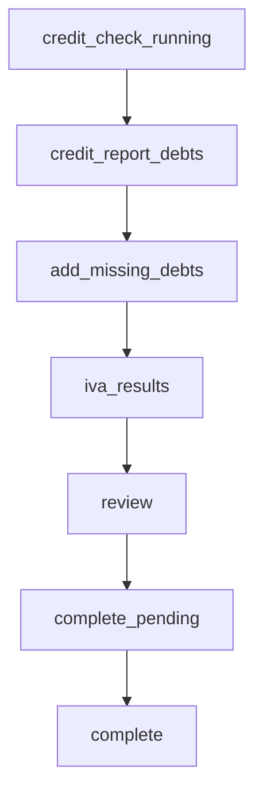

# Portal Results Phase Plan

## Core Approach
- Keep portal/session infrastructure unchanged: `lead_portal_tokens`, `lead_portal_progress`, snapshots, email clicks, and credit-check V3 routes stay in place.
- Use canonical Jinx data for financial outcomes:
  - Debts: `debts` + `debt_documents`
  - I&E: `leads.financial_statement` via `FinancialStatementService::persistForLead()`
  - Portal progress only controls customer journey steps.
- Add small services/presenters rather than embedding more logic in `LeadPortalController`:
  - `app/Services/LeadDebtService.php` for shared canonical debt creation, extracted from the inline agent route in `routes/web.php`.
  - `app/Services/LeadPortalDebtPresenter.php` for `customerFacingCreditorName(Debt $debt)` and debt list formatting.
  - `app/Services/LeadPortalFinancialStatementMapper.php` for portal income/costs -> Jinx I&E JSON.
  - `app/Services/LeadPortalIvaEstimateService.php` for total debt, IVA threshold, write-off estimate, and CCJ note flag.

## Step Flow Changes
- Update credit-check poll completion in `app/Http/Controllers/Portal/LeadPortalController.php`:
  - Current: `credit_check_running -> review`
  - New: `credit_check_running -> credit_report_debts`
- Add routes in `routes/web.php`:
  - `POST /portal/{token}/credit-report-debts/continue` -> `portal.credit-report-debts.continue`
  - `POST /portal/{token}/missing-debts` -> `portal.missing-debts.save`
  - `POST /portal/{token}/iva-results/continue` -> `portal.iva-results.continue`
- Render new step branches in `resources/views/portal/entry.blade.php`:
  - `credit_report_debts`: list imported `source_expected = credit_check` debts, total found, and friendly “some debts may not show” copy.
  - `add_missing_debts`: multiple rows with creditor select/search, “Other”, free-text creditor/reference, balance, and skip allowed.
  - `iva_results`: careful IVA guidance based on canonical total debt.
  - `review`: final summary after IVA page, listing all canonical debts and the IVA estimate.

## Creditor Display
- Implement `LeadPortalDebtPresenter::customerFacingCreditorName(Debt $debt): string`.
- Logic:
  - If `$debt->creditor?->name === 'Could Not Match'` and `reference` starts like `Raw creditor: British Gas`, show `British Gas`.
  - Otherwise show the matched creditor name.
  - If neither exists, use a customer-safe fallback like `Creditor`.
- Use this presenter in:
  - Portal review/result/debt steps in `resources/views/portal/entry.blade.php`
  - `LeadPortalCompletionService` snapshot debt payload
  - `LeadPortalSummaryMail` / `resources/views/emails/portal-summary.blade.php`
- Backend rows remain unchanged.

## Verification Change
- Update `resources/views/portal/verify.blade.php` to remove DOB and ask for postcode only.
- Update `LeadPortalController::verify()` and replace `passesSoftVerification()` behavior:
  - Postcode is required.
  - If lead has postcode: compare normalized uppercase/no-spaces values.
  - If lead postcode is blank: accept submitted postcode, store using current portal uppercase storage helper, and verify.
  - Keep generic error and existing rate-limit behavior.
- Existing DOB on leads remains untouched; it is just no longer a verification input.

## Canonical Missing-Debt Storage
- Extract current agent debt creation from `routes/web.php` into `LeadDebtService::createForLead(Lead $lead, array $data): Debt`:
  - Create `Debt`.
  - Create `DebtDocument` with `proof_type = source_expected` and `is_complete = true` only for `credit_check`, matching current route behavior.
  - Run `LeadChecklistService::syncForLead($lead)`.
- Update the existing agent route to call the service and keep its response shape unchanged.
- Portal missing-debt save will use the same service with `source_expected = customer_added`.
- For selected creditor rows:
  - `creditor_id = selected id`
  - `reference = null` unless user supplied extra text
- For “Other” rows:
  - `creditor_id = Could Not Match` creditor row
  - `reference = free-text creditor name`
- Ignore fully blank rows, and never use `lead_id` from request body.
- Add `customer_added` as an accepted source in debt update/create validation and checklist labels, without removing existing sources.

## IVA Results
- Implement estimate service with:
  - `total_debt = sum(balance)` across canonical debts for the lead, including `credit_check` and `customer_added`.
  - IVA threshold: `total_debt >= 6000`.
  - Example repayment: `100 * 60 = 6000`.
  - Potential write-off: `max(total_debt - 6000, 0)`.
  - CCJ flag: any debt creditor name `County Court Judgment` or relevant reference text.
- Use cautious copy only: `could`, `may`, `subject to assessment`.

## I&E Mapping
- Keep existing portal lead columns for compatibility, but write canonical I&E JSON too.
- Inject/use `FinancialStatementService` through `LeadPortalFinancialStatementMapper`.
- Income mapping:
  - Employed full-time / part-time -> `income.salary`
  - Self-employed -> `income.self_employed`
  - Benefits -> `income.universal_credit`
  - Pension -> `income.pensions`
  - Other -> `income.other_income`
- Costs mapping:
  - housing -> `expenditure.rent_mortgage`
  - council tax -> `expenditure.council_tax`
  - electricity -> `expenditure.electric`
  - gas -> `expenditure.gas`
  - water -> `expenditure.water`
  - food/travel: keep a light UI but map food to `expenditure.food`; if a separate travel field is added in UI, map to `public_transport` or fuel only if explicitly captured.
- Update costs UI to collect electricity, gas, and water separately. No migration is needed: values can go directly into `financial_statement`; `monthly_utilities_cost` can remain as the compatibility sum.

## Snapshot And Email
- Update `LeadPortalCompletionService` snapshot to include:
  - all canonical debts used in review/email with customer-facing names
  - source labels including `Credit check` and `Customer added`
  - IVA estimate payload
  - full financial statement summary/mapped values
- Update `LeadPortalSummaryMail` and `resources/views/emails/portal-summary.blade.php`:
  - show normal name/postcode/address where available, not masked postcode
  - continue avoiding full DOB unless needed
  - list all individual debts
  - include total debt and IVA estimate section when threshold met
  - keep WhatsApp CTA through `portal.summary.click`
  - optionally show phone CTA from `services.portal.call_url` or `services.company.phone_number` if available.

## Tests
- Extend `tests/Feature/LeadPortalEntryTest.php` for:
  - postcode-only verification and fallback postcode save
  - credit-check completion moving to `credit_report_debts`
  - credit-report debt confirmation step
  - missing selected-creditor and Other debt creation into canonical `debts`
  - tampered `lead_id` ignored
  - IVA result threshold, sub-threshold, and CCJ note
  - review lists all canonical debts with customer-facing names
  - portal income/costs maps into `financial_statement`
- Extend mail/snapshot tests in existing portal completion coverage for:
  - all debts in snapshot and email
  - Could Not Match display cleanup
  - IVA estimate in snapshot/email
  - tracked WhatsApp CTA preserved
- Add/adjust agent regression tests around the extracted debt service so existing `POST /lead/{id}/debts` response remains unchanged.

## Manual Migrations
- No required migration planned.
- Existing portal lead columns remain for compatibility.
- New electricity/gas/water values will be persisted in `leads.financial_statement` JSON rather than new lead columns.